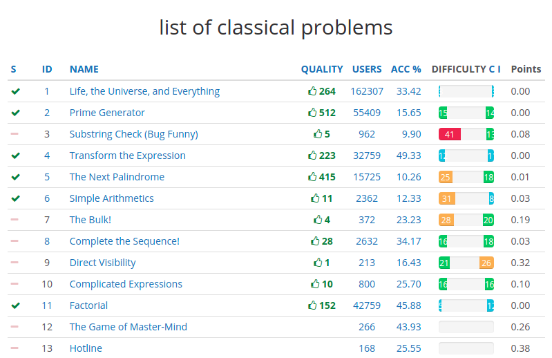

# SPOJex

A chrome extension for SPOJ users showing the problem scores.

## Getting started

### Installation (manually)
1. Download the [SPOJex.crx](SPOJex.crx)
2. Drag & Drop the `SPOJex.crx` on to the Extensions page.

## Current Features
* Points displayed on the problem lists.

  { width=50% }

* Points displayed on each problem page.

  

## Future Plans
* Problem Bookmarks.
* Print the problem statements.
* Make the problem statements readable.

## Development

If you have any trouble, feel free to create a [GitHub issue](https://github.com/igarash1/SPOJex/issues). Your contribution is welcome!

## Acknowledgement

This extension is mainly based on Better-SPOJ(http://github.com/pulkitsharma07/Better-SPOJ) developed by Pulkit Sharma.

## License 

 [MIT License 2.0](LICENSE)
 